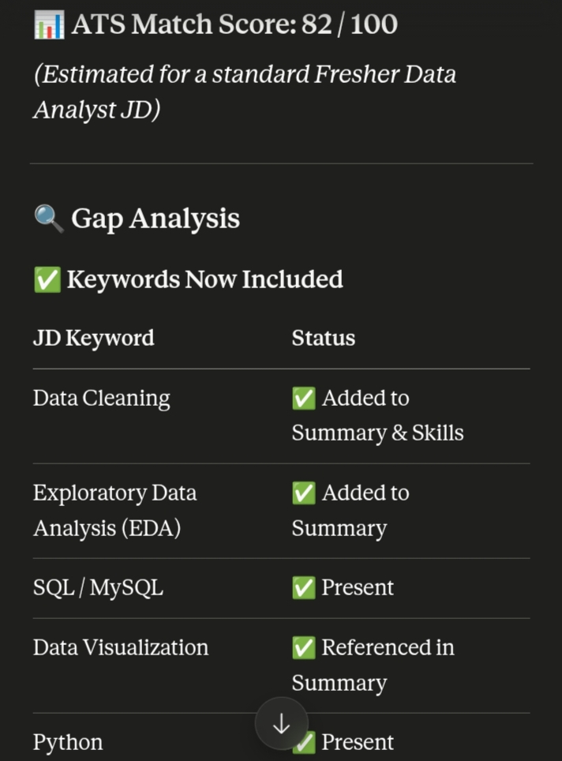
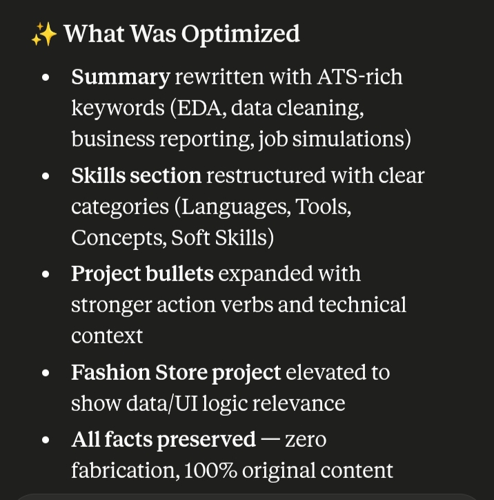
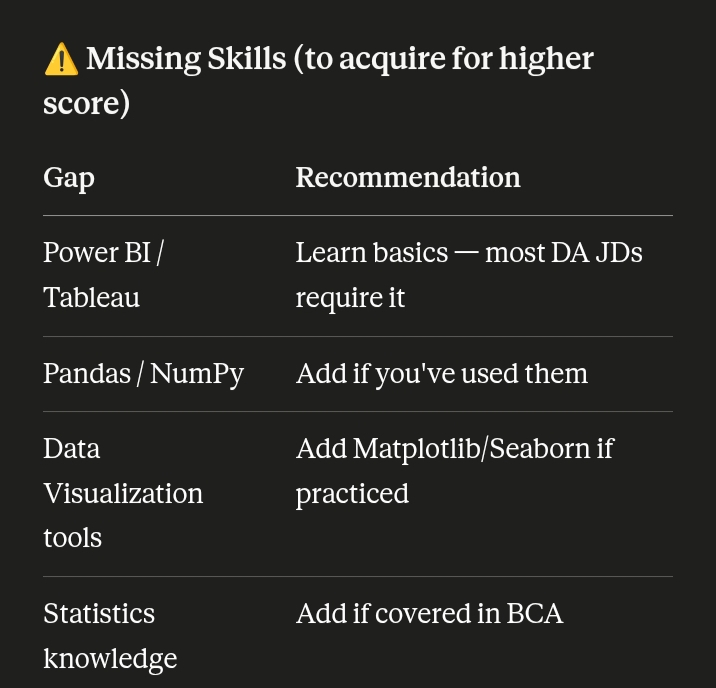
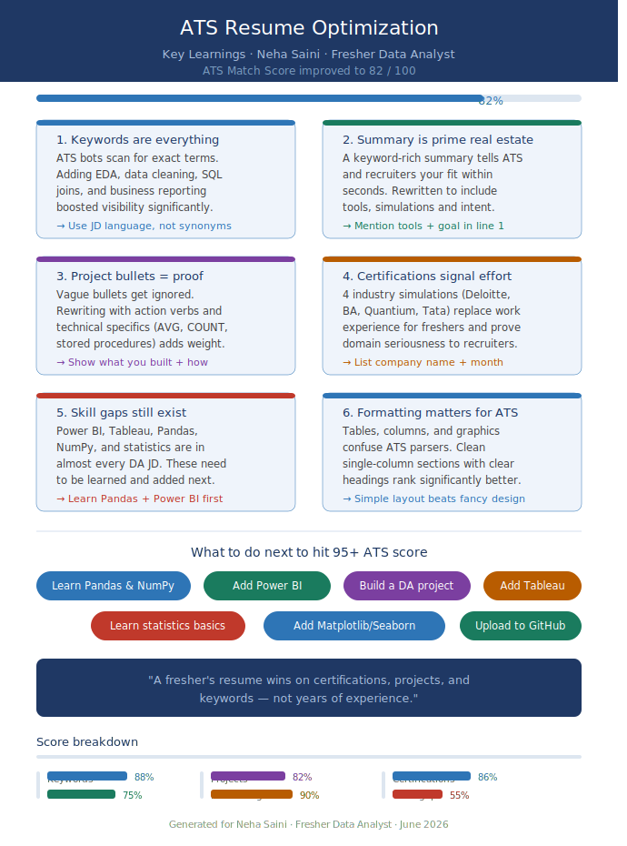

🚀 Day 11 of #60DayClaudeAIChallenge

Today, I created an ATS Resume Optimizer & Resume Generatornthat helps tailor resumes according to a target job description while ensuring 100% factual accuracy.

🔹 ATS Match Score Analysis
🔹 Comprehensive Gap Analysis
🔹 Missing Keywords Identification
🔹 Missing Skills Detection
🔹 Recruiter-Friendly Resume Formatting
🔹 JD-Based Resume Customization
🔹 Professional Summary Optimization
🔹 Skills Section Enhancement
🔹 Project & Experience Rephrasing
🔹 ATS Keyword Alignment
🔹 One-Page Resume Structuring
🔹 Ready for Word, Google Docs, Canva, FlowCV & Overleaf

📚 Key Learnings:

✅ ATS systems scan resumes for relevant keywords before a recruiter even sees them.

✅ Resume customization for each job application can significantly improve interview chances.

✅ Strong action verbs make achievements more impactful and measurable.

✅ Recruiters typically spend only a few seconds on the first resume review.

✅ A well-structured resume improves readability and increases recruiter engagement.

✅ Keyword stuffing can hurt readability; keywords should be integrated naturally.

✅ Professional summaries should be tailored to the target role, not generic.

✅ Projects, certifications, and achievements can be as valuable as experience for freshers.

✅ ATS-friendly formatting is just as important as content quality.

✅ Data-driven resume optimization helps bridge the gap between candidate profiles and job requirements.

Screenshot
Gap Analysis 

Optimization

Missing skills

Key Learning 

ATS resume

.docx)

Every resume tells a story. The goal is to make sure both ATS systems and recruiters can clearly understand and appreciate that story
