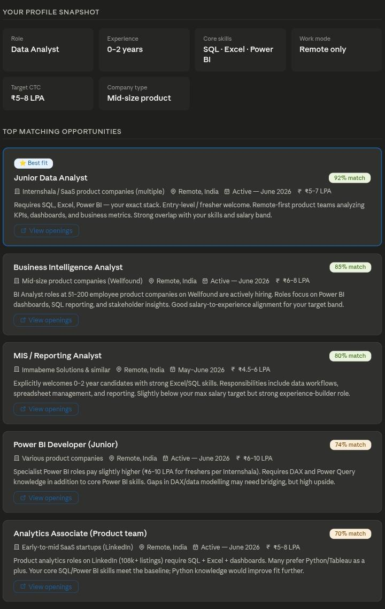
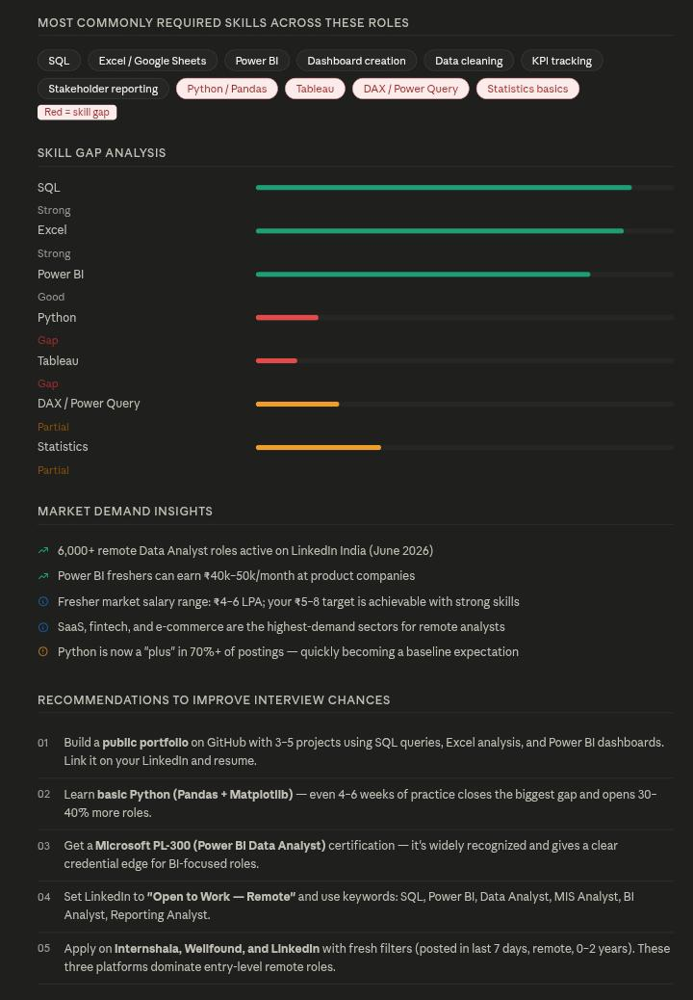
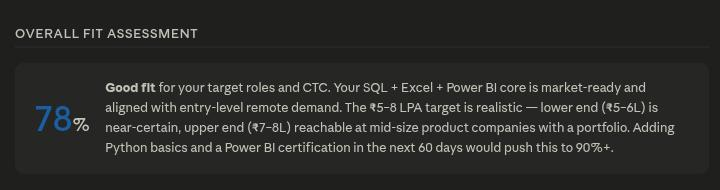
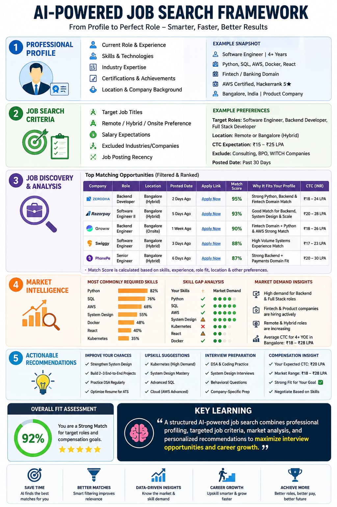

🚀 Day 13/60 of #60DayClaudeAIChallenge

Today, I explored how AI can transform the entire job search process into a structured, data-driven system.

Using a carefully designed prompt framework, I created a workflow that:
✅ Builds a professional profile

✅ Defines targeted job search criteria

✅ Discovers high-fit opportunities

✅ Performs skill gap analysis

✅ Provides market demand insights

✅ Generates personalized career 
recommendations

This exercise highlighted that effective prompting isn't just about generating content—it's about creating systems that solve real-world problems and support better decision-making.

Screenshot 

Key Learning 

💡 Key Learning:
The quality of outputs depends on the quality of inputs. A well-structured prompt can turn AI into a powerful career strategist.

What would be the most valuable feature you'd want in an AI-powered job search assistant?
