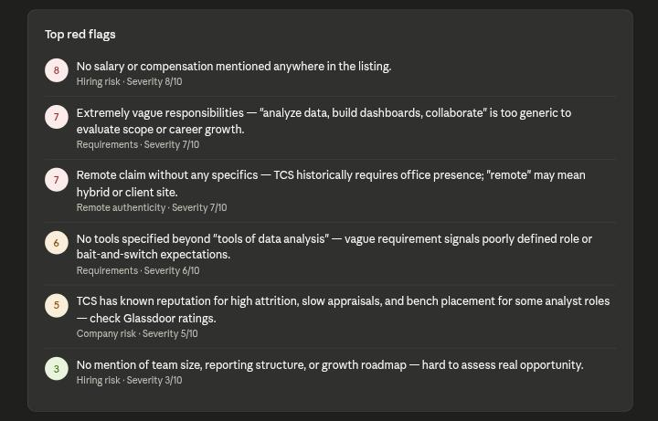
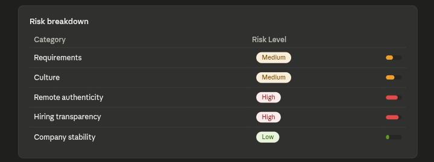
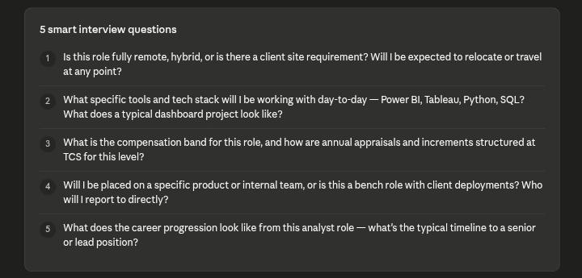
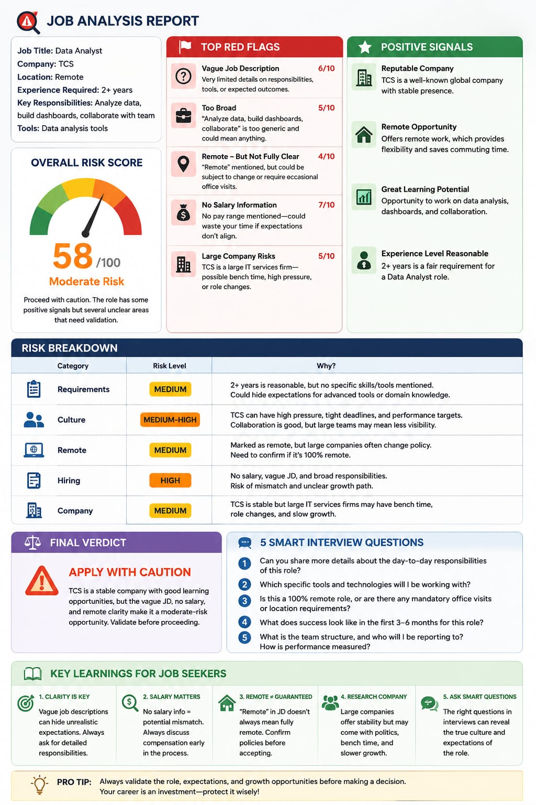

🚀 Day 14/60 of #60DayClaudeAIChallenge

Today, I built an AI-powered Job Red Flag Detector that helps job seekers analyze job descriptions and company information before applying.

🔍 It identifies:
• Unrealistic job requirements
• Toxic workplace signals
• Fake or misleading remote roles
• Hiring risks and suspicious practices
• Company stability concerns

💡 One of the biggest mistakes job seekers make is applying without evaluating the opportunity itself. This prompt helps uncover hidden red flags and prepares smarter interview questions.

Screenshots

Key Learning 

🎯 Key Learnings:
✅ AI can identify hidden red flags in job descriptions.
✅ Analyze workplace culture before accepting an offer.
✅ Detect unrealistic expectations and role mismatches.
✅ Evaluate remote job authenticity and hiring risks.
✅ Researching companies is as important as optimizing resumes.
✅ AI can generate smarter interview questions for better decisions.
✅ Prompt engineering can support data-driven career choices.

