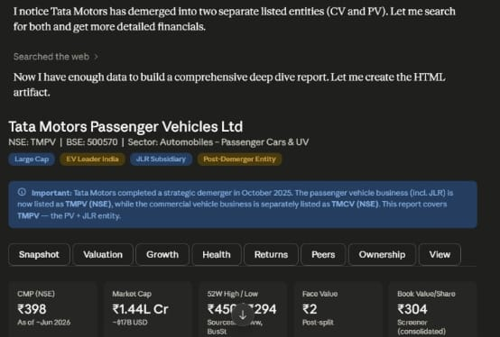
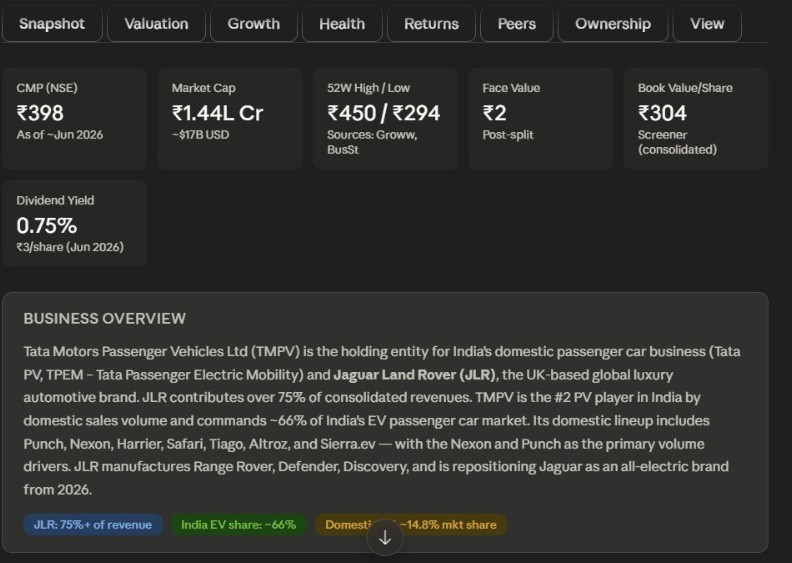
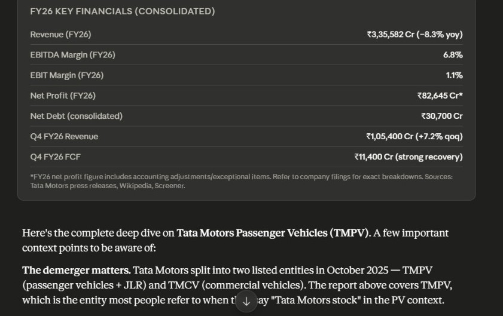
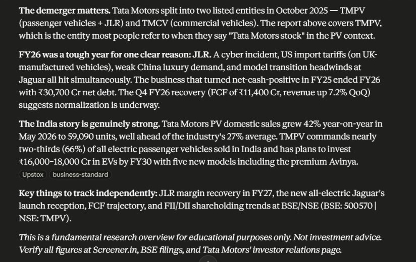

🚀 Day-16 of 60DayClaudeAIChallenge 

Built an AI-Powered Stock Research Dashboard using Claude!
Recently, I explored how AI can transform financial research by creating a comprehensive deep-dive analysis dashboard for Tata Motors Passenger Vehicles (TMPV).
📊 The dashboard automatically: ✅ Collects and analyzes financial data
✅ Summarizes business fundamentals
✅ Tracks key financial metrics and growth indicators
✅ Highlights industry trends and market positioning
✅ Presents insights in a clean, interactive dashboard format
Key Takeaways:
🔹 AI can significantly reduce the time required for fundamental research.
🔹 Complex financial information can be transformed into easy-to-understand visual insights.
🔹 Combining web research, data analysis, and dashboard design creates a powerful investment research workflow.
🔹 Claude Artifacts can generate professional-grade reports with minimal manual effort.
What I Learned:
💡 Prompt engineering for financial analysis
💡 AI-assisted research workflows
💡 Data storytelling and dashboard design
💡 Converting raw financial data into actionable insights
This project reinforced how AI is becoming a powerful partner for analysts, researchers, and investors.

First

Second

Third

Fourth

📈 Always learning, building, and exploring new ways to leverage AI for real-world problem solving.
