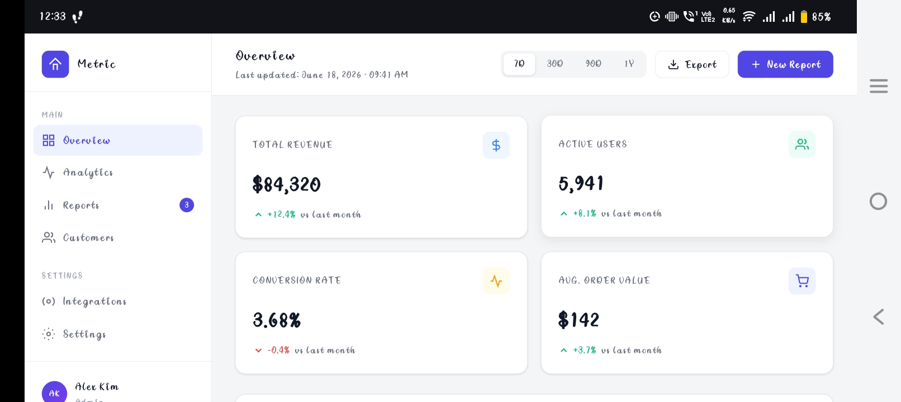
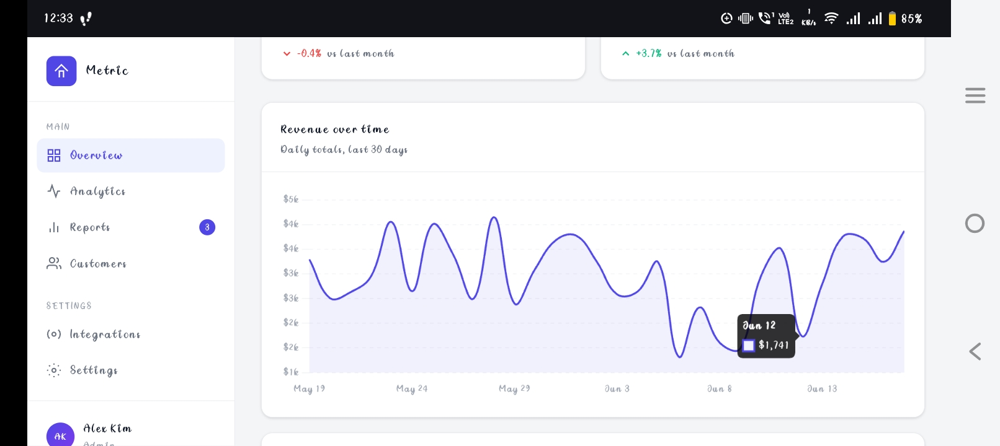
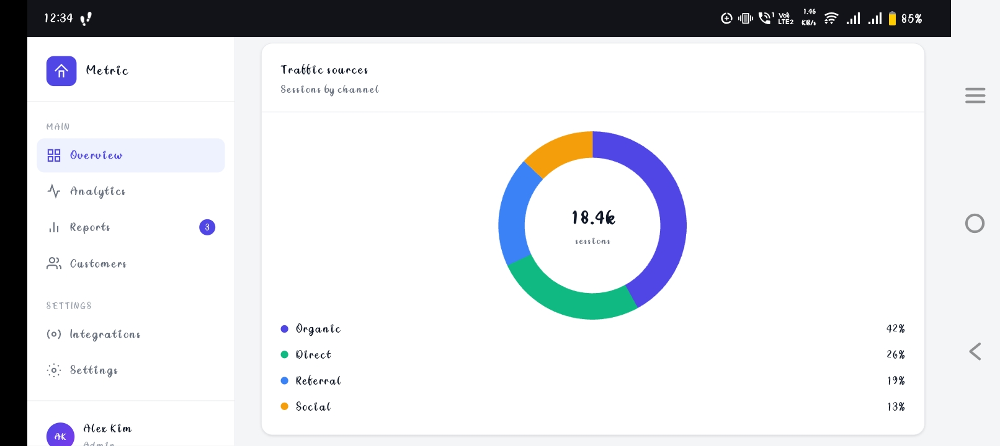
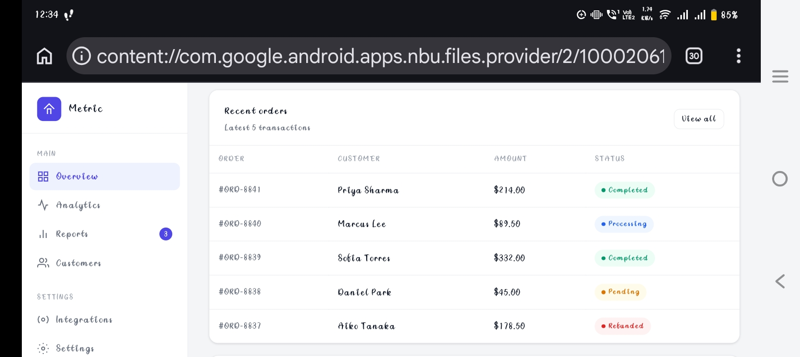
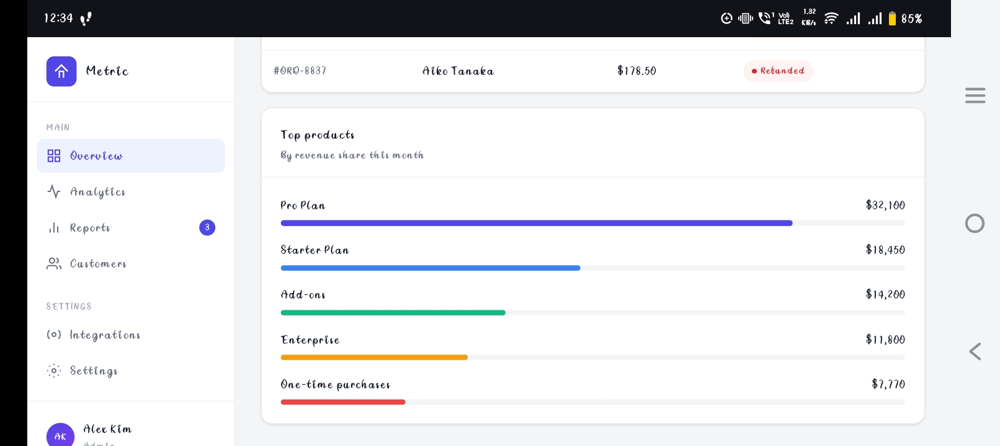

🚀 Day 18 of #60DayClaudeAIChallenge

Today, I built a powerful AI skill: 
Brain Dump Action Planner

One of the biggest productivity challenges is turning scattered thoughts, meeting notes, voice memos, brainstorming sessions, and messy transcripts into actionable plans. This prompt solves exactly that.

✨ What it does:
✅ Converts unstructured notes into organized summaries
✅ Extracts key takeaways automatically
✅ Identifies action items with owners, deadlines, and status
✅ Highlights open questions and unresolved decisions
✅ Detects risks, blockers, and conflicts
✅ Preserves all original information without assumptions
✅ Generates a modern interactive HTML dashboard

The output follows a project-management style structure inspired by tools like Notion, ClickUp, Asana, Airtable, and Linear.

🔑 Key Learnings:
• Structured prompts create significantly better outputs than generic instructions
• Information organization is as important as information generation
• AI can act as a project coordinator, not just a content generator
• Preserving source accuracy prevents misinformation and confusion
• Interactive HTML artifacts improve readability and decision-making
• Well-defined workflows make AI outputs more reliable and reusable
• Breaking complex tasks into sections improves clarity and execution

Screenshot 
First

Second

Third

Fourth

Fifth

