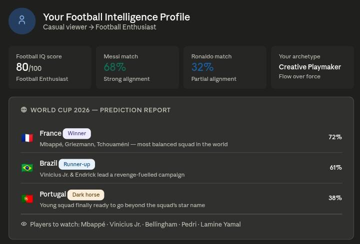
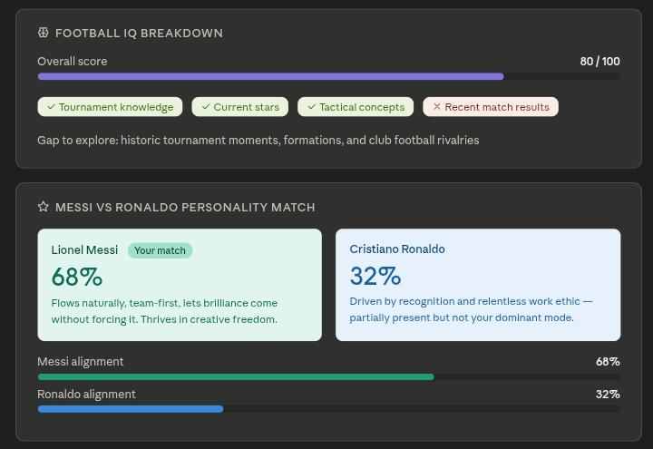
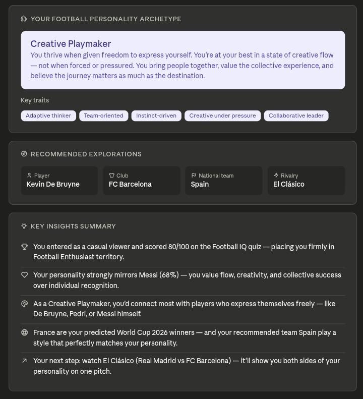

🚀 Day 19/60 – Building a Football Intelligence Hub with AI ⚽

Today's challenge was all about combining sports analytics, personality assessment, and interactive learning into a single AI-powered experience.

I designed a Football Intelligence Hub Prompt that guides users through:

🏆 FIFA World Cup 2026 Prediction Report

* Winner, runner-up, dark horse predictions
* Confidence scores with evidence-based reasoning
* Players to watch and risk analysis

🧠 Football IQ Assessment

* Adaptive quiz based on knowledge level
* Football Awareness Score (0–100)
* Fan classification and knowledge-gap analysis

🐐 Messi vs Ronaldo Personality Match

* Personality-based compatibility scoring
* Football archetype identification
* Personalized player, club, national team, and rivalry recommendations

The goal was to create an engaging experience that blends **sports intelligence, predictive analysis, gamification, and personality insights** into one seamless journey.

Key Learning:
✅ AI can personalize experiences based on user knowledge levels
✅ Structured multi-stage prompts improve engagement
✅ Personality frameworks make sports content more interactive
✅ Data-driven predictions become more valuable when paired with explanations and confidence scores

First

Second

Third 

