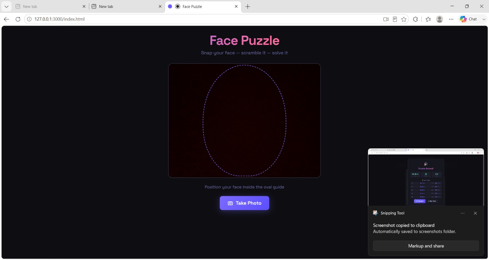
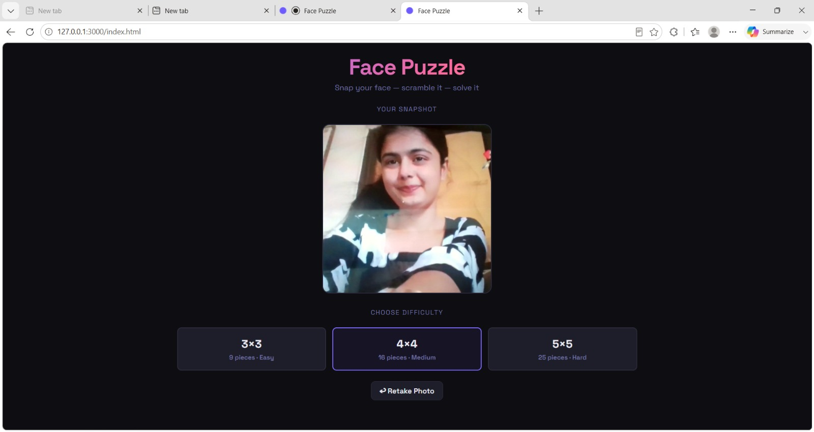
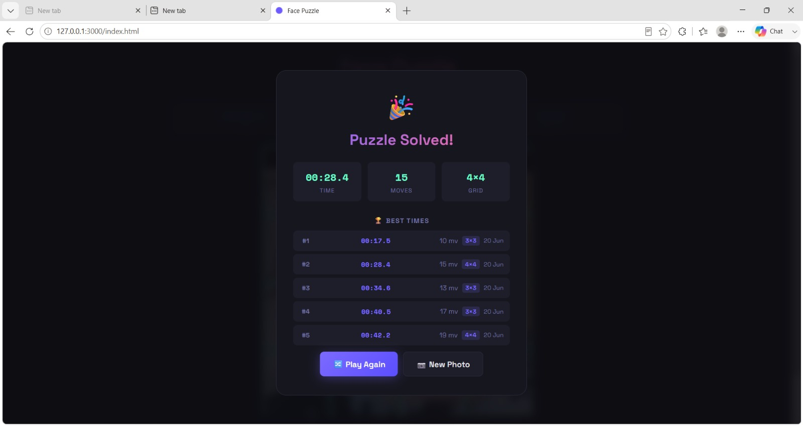

🚀 Excited to Share My Latest Project: Face Puzzle Game! 🎮🧩
I recently built an interactive Face Puzzle Game using modern web technologies, where users can capture/upload their photo, choose a difficulty level, and solve a personalized sliding puzzle challenge.

✨ Key Features:
🔹 Capture or upload your own photo
🔹 Multiple difficulty levels (3×3, 4×4, 5×5)
🔹 Real-time move counter and timer
🔹 Best score tracking & leaderboard
🔹 Responsive and modern UI design
🔹 Smooth gameplay experience

💡 Through this project, I strengthened my skills in:
Frontend Development
JavaScript Logic Building
DOM Manipulation
UI/UX Design
Problem Solving
Performance Optimization

screenshots
one

two 

three 

Building projects like this helps transform theoretical knowledge into practical experience and enhances creativity in application development.
I'd love to hear your feedback and suggestions for future improvements! 😊
