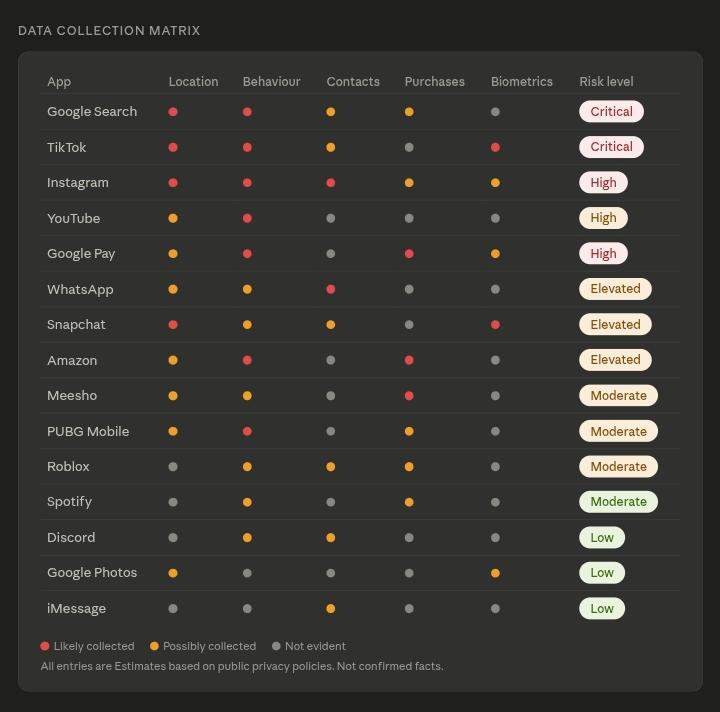
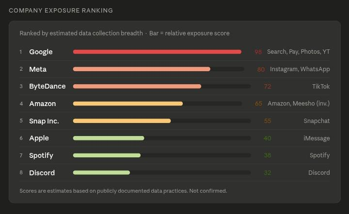
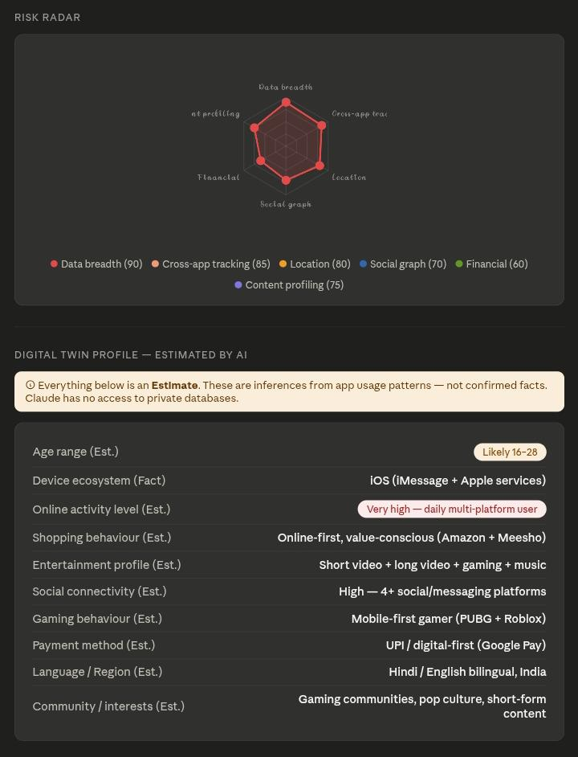
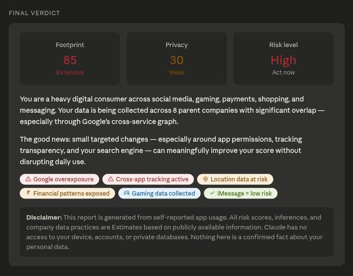
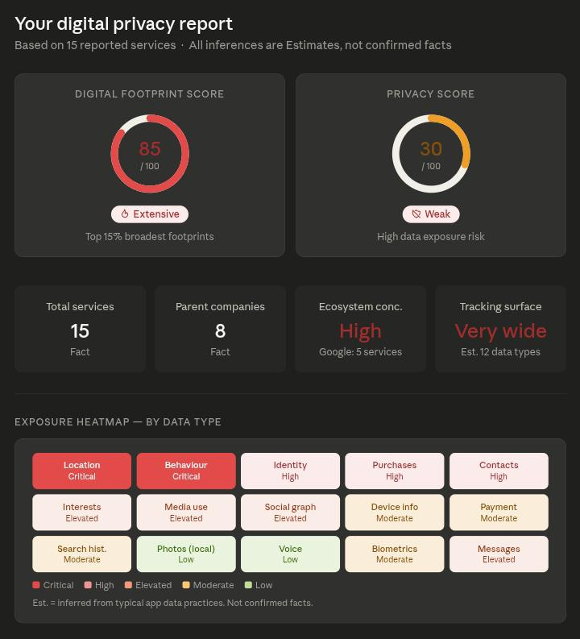

Day 21 of #60DayClaudeAIChallenge

Today, I built an AI-powered **Digital Footprint & Privacy Intelligence Dashboard** that transforms a user's reported app usage into a comprehensive cybersecurity and privacy assessment.

🚀 What this dashboard generates:

✅ Digital Footprint Score
✅ Privacy Score
✅ Exposure Heatmap
✅ Company Exposure Ranking
✅ Data Collection Matrix
✅ Risk Radar
✅ Digital Twin Profile
✅ Most Valuable Data Assets Analysis
✅ Privacy Improvement Simulator
✅ Personalized Privacy Improvement Plan
✅ Final Cybersecurity Verdict

The dashboard analyzes commonly used platforms such as social media, messaging apps, gaming platforms, shopping apps, payment services, search engines, and cloud services to estimate:

🔹 Digital exposure levels
🔹 Ecosystem concentration risks
🔹 Data collection likelihood
🔹 Tracking surface area
🔹 Potential digital twin creation risks

One important design principle:
📌 Facts and Estimates are clearly separated.
📌 No claims of accessing private databases.
📌 No assumptions presented as certainty.

This project combines:
💡 Cybersecurity
💡 Privacy Engineering
💡 Data Intelligence
💡 Risk Assessment
💡 Interactive Dashboard Design

Screenshot 

First

Second

Third 

Fourth

Fifth

