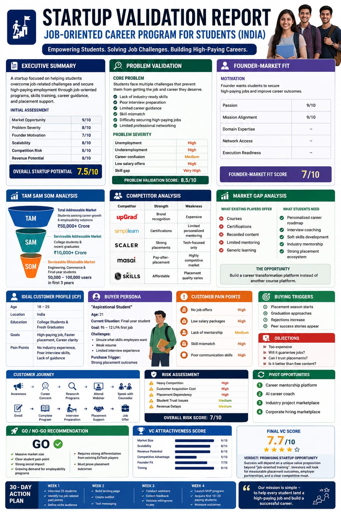

🚀 Day 22/60 of #60DayClaudeAIChallenge

Today, I explored how AI can be used as a Startup Advisor, VC Analyst, and Market Research Expert to validate a business idea in minutes.

📊 I created a complete Startup Validation Report for a Job-Oriented Career Program focused on helping students secure high-paying jobs.

The analysis included:

✅ Executive Summary
✅ Problem Validation
✅ Founder-Market Fit
✅ TAM, SAM & SOM Analysis
✅ Competitor Benchmarking
✅ Market Gap Identification
✅ Ideal Customer Profile (ICP)
✅ Buyer Persona
✅ Customer Journey Mapping
✅ Risk Assessment
✅ Pivot Opportunities
✅ Go / No-Go Recommendation
✅ 30-Day Action Plan

screenshot
Valuation report

💡 Key Insight:
Building a successful startup isn't just about having an idea—it's about validating the problem, understanding the market, and identifying a clear competitive advantage.

AI is making startup research, market analysis, and strategic planning faster and more accessible than ever before.

What do you think is the biggest challenge for students trying to land high-paying jobs today?

#60DayClaudeAIChallenge #StartupValidation #MarketResearch #BusinessStrategy #Entrepreneurship #StartupIndia #EdTech #CareerDevelopment #AI #ArtificialIntelligence #Innovation #ProductManagement #LinkedInChallenge
