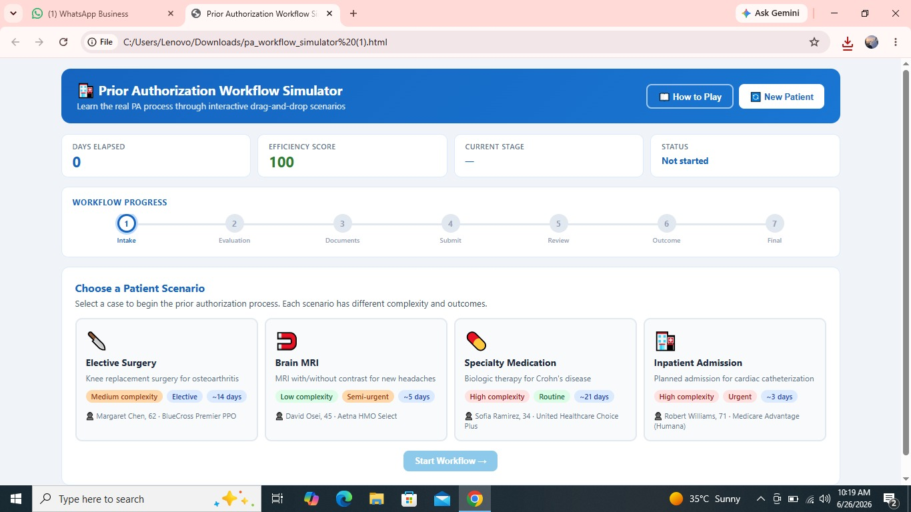
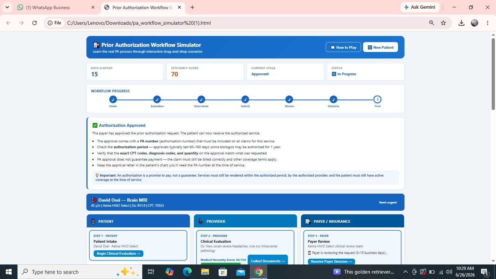
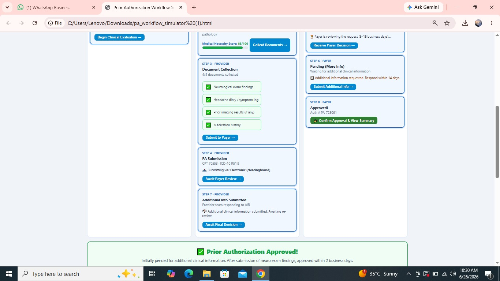
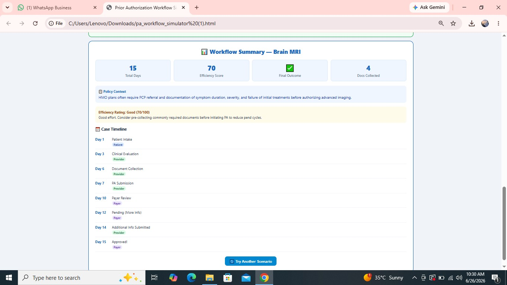

🚀 Day 26 of #60DayClaudeAIChallenge

Today, I challenged AI to build a Prior Authorization Workflow Simulator—a fully interactive, gamified healthcare training application built as a single HTML file using only HTML, CSS, and Vanilla JavaScript.

🏥 What it simulates:
✅ Patient, Provider & Payer workflow lanes
✅ Drag-and-drop case progression
✅ Multiple real-world patient scenarios
✅ Medical necessity evaluation
✅ Prior Authorization documentation collection
✅ Payer submission & review process
✅ Approval, Pend, Denial, Appeal & Peer-to-Peer Review outcomes
✅ Educational explanations after every step
✅ Progress tracker, days elapsed & efficiency score
✅ Celebration animation on approval 🎉
✅ Workflow summary & restart functionality
✅ Responsive modern UI with zero external dependencies

Screenshot 

First

Second

Third 

Fourth

This project demonstrates how AI can transform complex healthcare operations into an engaging learning experience. Instead of reading static process documents, learners can interact with the complete Prior Authorization lifecycle through simulation and gamification.

Every day of this challenge reinforces one idea: AI isn't just generating content—it's accelerating the creation of practical, educational, and industry-ready applications.

