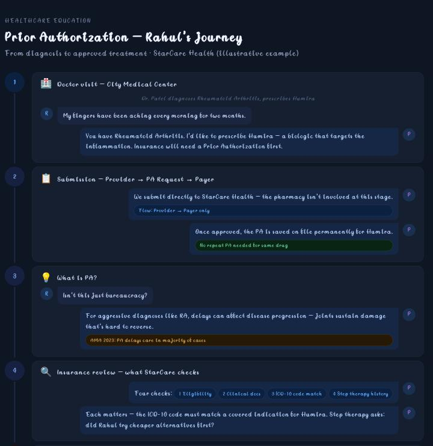
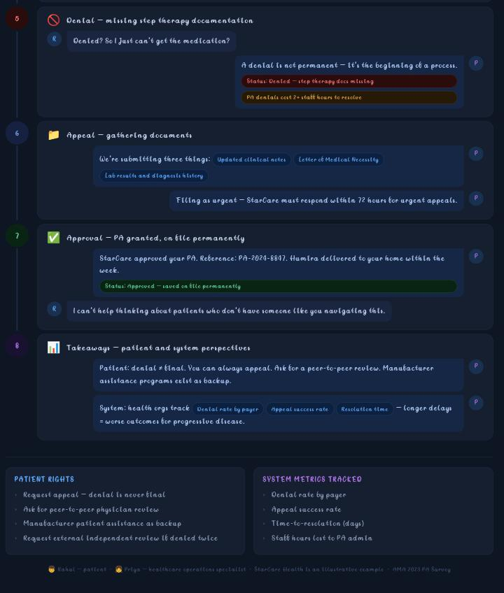

🚀 Day 27 of #60DayClaudeAIChallenge

Today, I built an Interactive Prior Authorization (PA) Story Simulator to simplify one of the most complex workflows in U.S. healthcare.

Instead of reading long documents, users experience the PA journey through a story-driven simulation featuring a patient (Rahul) and a healthcare operations specialist (Priya).

✨ What the simulator covers:
• Doctor visit and prescription
• Prior Authorization submission
• Understanding why PA exists
• Insurance review process
• Denial due to missing documentation
• Appeal workflow
• Final approval with reference number
• Key takeaways from both patient and healthcare system perspectives

💡 Every scene includes interactive choices that influence the conversation, making learning engaging and beginner-friendly.

From a technical perspective, this project was built as:
✅ Single-file HTML application
✅ Tailwind CSS
✅ Vanilla JavaScript
✅ Dynamic DOM rendering using `createElement()` and `appendChild()` (without using `innerHTML` for chat updates)
✅ Progress tracking with an append-only chat experience

Screenshots
First

Second

This challenge continues to push me to combine AI prompting, healthcare operations, product thinking, and interactive web development into practical learning experiences.
