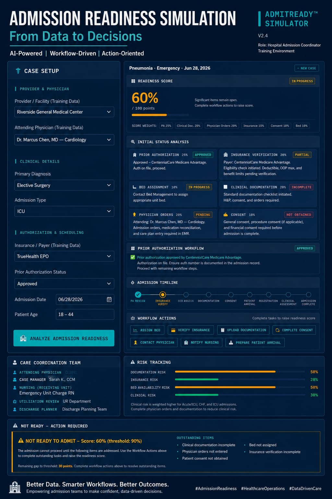

🚀 Day 28/60 of the #60DayClaudeAIChallenge 

Today I built a Hospital Admission Readiness Simulator—an interactive healthcare training application that puts users in the role of a Hospital Admission Coordinator

🏥 Key features include:
✅ Prior Authorization decision pathways (Approved, Pending, Denied with Appeals)
✅ Insurance verification and admission readiness scoring
✅ Bed assignment and documentation workflow
✅ Physician orders and patient consent tracking
✅ CMS Observation Status guidance with the 2-Midnight Rule
✅ Acute MI & CHF medical necessity reminders using InterQual/Milliman criteria
✅ Care Coordination with Attending Physician, Nursing, Case Management, Utilization Review, and Discharge Planning
✅ Timeline-based admission workflow from PA Review to Admission Complete
✅ Risk tracking across documentation, insurance, bed availability, and clinical readiness
✅ Governance insights with healthcare industry benchmark estimates

Screenshot 

Image

This project demonstrates how AI can transform complex hospital admission workflows into engaging, hands-on simulations for healthcare operations training.

Every day of this challenge pushes me to build practical AI-powered solutions for real-world problems while sharpening my prompt engineering and product design skills.
