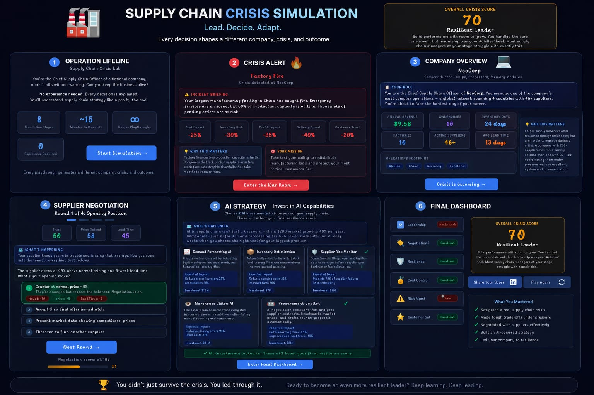

🚨 Day 29 of #60DayClaudeAIChallenge

Today I built Operation Lifeline: Supply Chain Crisis Lab — an interactive simulation that transforms complex supply chain concepts into an engaging decision-making experience.

🎮 In this simulation, you become the Chief Supply Chain Officer of a fictional company facing an unexpected crisis. Every decision shapes the company's future, making each playthrough unique.

✨ Key Features
• Randomly generated companies with realistic operational metrics
• Dynamic crisis scenarios like factory fires, cyberattacks, supplier bankruptcies, floods, and port strikes
• War Room where every response has measurable business consequences
• Multi-round supplier negotiation with branching outcomes
• CEO Boardroom leadership assessment
• AI investment strategy to future-proof operations
• Comprehensive performance dashboard with personalized feedback and lessons learned

💡 My goal wasn't just to build another simulator—it was to make supply chain management understandable for complete beginners.

Every decision includes:
✅ Context before action
✅ Plain-English explanations
✅ "Why this matters" insights
✅ Immediate business impact visualization

Screenshot 

Image

The entire project is built as a single-file React application using only HTML, CSS, JavaScript, and React via CDN—no backend, no external APIs, and fully offline capable.

Building projects like this continues to challenge me to combine AI-assisted development, product thinking, UX design, and educational storytelling into experiences that are both engaging and practical.

Every day of this challenge is another opportunity to learn by building.

#60DayClaudeAIChallenge #ClaudeAI #ReactJS #FrontendDevelopment #JavaScript #SupplyChain #OperationsManagement #AIStrategy #ProductDesign #UXDesign #Simulation #LearningByBuilding #WebDevelopment #Innovation #Tech
