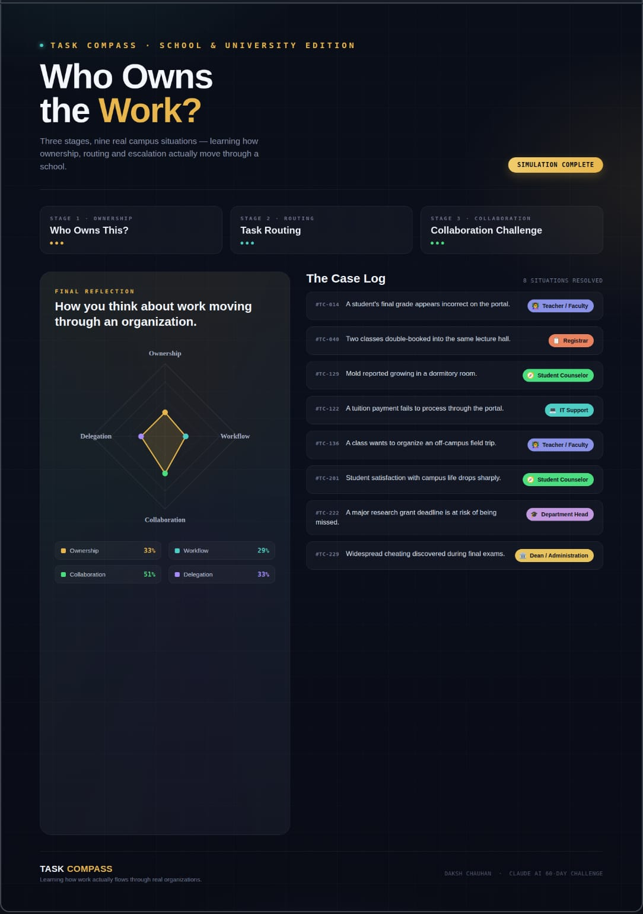

🚀 Day 37 of #60DaysClaudeAIChallenge

🧭 Just wrapped a simulation on something we rarely stop to think about: who actually owns the work when things go sideways in an institution.
I built "Task Compass — School & University Edition" — 8 real-world campus situations, from a grade error on the portal to a cheating scandal during finals — and had to route each one to the right owner: Teacher, Registrar, IT Support, Student Counselor, Department Head, or Dean.
The reflection score surprised me. My instinct leaned heavily toward Collaboration (51%) — pulling people in, looping stakeholders — over pure Ownership (33%) or clean Delegation (33%). Turns out my default isn't "whose desk is this," it's "who else needs to be in the room."
A few things this drove home:
→ Ownership isn't always obvious — a "grade issue" can be a teacher problem, a registrar problem, or both
→ Escalation paths matter as much as the decision itself
→ Good routing is a skill, not a guess — and most orgs never train for it
Part of my ongoing Claude AI 60-Day Challenge — building interactive decision simulations to learn systems thinking by doing, not reading.
Curious how others would route #TC-222 (grant deadline at risk) or #TC-229 (cheating during finals) — drop your call below 👇

screenshot 
Image

