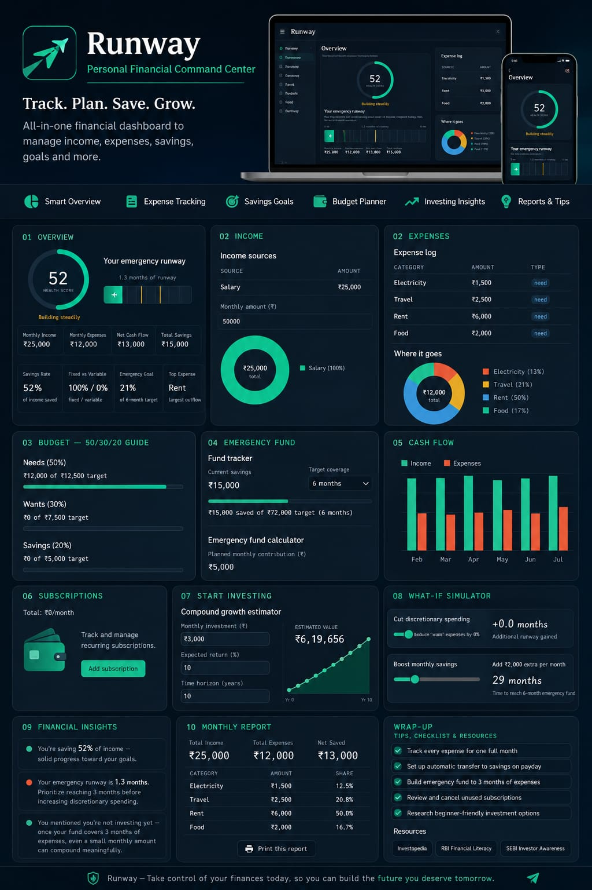

🚀 Day 42/60 — Built a Personal Financial Command Center with Claude AI

Today’s project was one of my most comprehensive dashboard builds so far.

I created "Runway – Personal Financial Command Center", an AI-assisted financial planning dashboard designed to help users understand, manage, and improve their financial health from a single interface.

The application goes beyond basic expense tracking and focuses on providing meaningful financial insights, planning tools, and actionable recommendations.

💡 Key Features

✅ Financial Health Score
✅ Emergency Fund Runway Tracker
✅ Income & Expense Management
✅ 50/30/20 Budget Analysis
✅ Cash Flow Visualization
✅ Subscription Monitoring
✅ Investment Growth Simulator
✅ What-If Financial Scenarios
✅ Financial Insights Engine
✅ Monthly Financial Reports
✅ Savings Goal Tracking
✅ Financial Literacy Resources
✅ AI Prompt Suggestions for Better Money Decisions

🎯 What Makes It Different?

Instead of acting like a traditional budgeting app, the dashboard behaves like a personal financial command center.

Users can:

• Understand where their money goes
• Measure financial stability
• Simulate future scenarios
• Track emergency fund readiness
• Visualize investment growth
• Receive personalized recommendations
• Generate printable financial reports

Screenshot 

Image

📚 What I Learned

Building financial products requires balancing:

Data visualization
User psychology
Financial literacy
Decision support systems
Clean dashboard UX

A good finance tool shouldn't just show numbers—it should help users make better decisions.

This challenge continues to push me beyond coding into product thinking, user experience, and problem solving.

