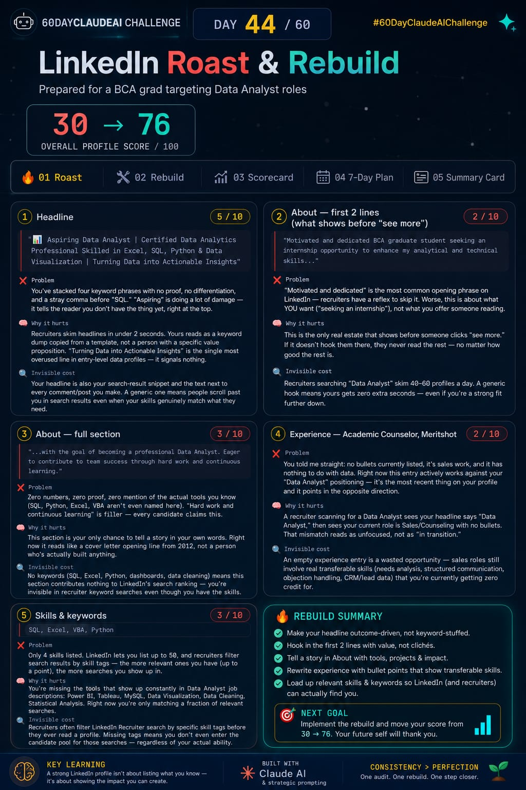

🚀 Day 44 of #60DayClaudeAIChallenge
LinkedIn Roast & Rebuild — From Invisible to Recruiter-Ready

Today, I built an AI-powered LinkedIn Optimization & Personal Branding Audit System that acts like an ex-recruiter reviewing your profile with complete honesty.

Instead of generic advice, it:

✅ Roasts your profile section by section
✅ Explains what recruiters actually think in the first 3 seconds
✅ Identifies hidden opportunities you're losing
✅ Rebuilds your headline, about section, experience, and skills
✅ Improves LinkedIn SEO and search visibility
✅ Creates a personalized 7-day activation plan
✅ Shows a clear Before vs After scorecard
✅ Generates a shareable LinkedIn summary card

The example audit in this project transformed a profile score from 30/100 → 76/100 by fixing:

🔹 Weak keyword-stuffed headline
🔹 Generic "motivated and dedicated" about section
🔹 Missing proof and measurable impact
🔹 Unoptimized experience descriptions
🔹 Poor skill selection and LinkedIn search visibility

Screenshot 

Image

Key Learning 💡
Most LinkedIn profiles fail not because people lack skills, but because they fail to communicate value quickly. Recruiters spend only a few seconds scanning a profile before deciding whether to continue.

Built With

🤖 Claude AI
🎯 Personal Branding Strategy
📊 Recruiter-Based Profile Auditing
🔍 LinkedIn SEO Optimization
💼 Career Growth Frameworks

Consistency > Perfection. One challenge. One build. One step closer
