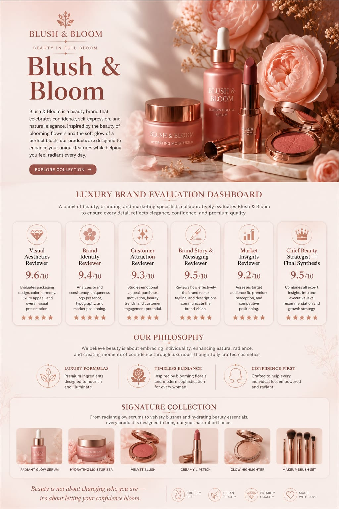

🚀 Day 47/60 — #60DayClaudeAIChallenge 

Today I built Content Intelligence Studio — an AI-powered content consulting platform designed to help creators, marketers, founders, and professionals optimize their content before publishing.

Instead of relying on generic feedback, the system creates a dynamic panel of specialized AI reviewers tailored to the content type, platform, and objective.
Whether it's a LinkedIn post, YouTube thumbnail, Instagram carousel, blog article, analytics screenshot, or transcript, every insight is generated through a multi-stage AI review workflow.

screenshot 
Image

✨ Key Features
• Multi-stage AI content review system
• Text and image analysis support
• Platform-specific optimization recommendations
• Hook, title, and messaging enhancement
• Content strengths and weaknesses analysis
• Missed opportunity detection
• AI-generated rewrites and alternatives
• Publishing readiness checklist
• Content health dashboard
• Executive summary and strategic recommendations
• Performance potential forecasting (AI estimate)
• Premium SaaS-inspired user experience

This project challenged me to think beyond content creation and focus on content intelligence — helping creators understand why content performs, not just what to publish.

Every day of this challenge continues to strengthen my skills in AI workflow design, prompt engineering, UX strategy, frontend development, and product thinking.
