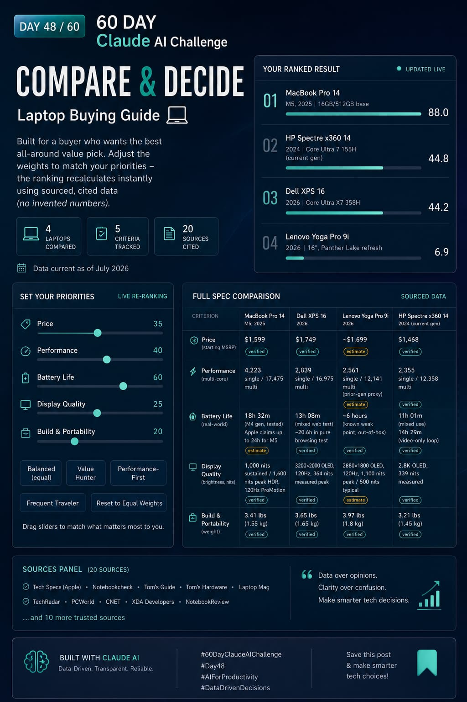

Day 48/60 — Building a Compare & Decide Builder 🧠

Every important decision comes with trade-offs. The challenge isn't finding information—it's knowing how to evaluate it objectively.

Today, I built a **Compare & Decide Builder**, an AI-powered system designed to help users make confident, evidence-based decisions. The tool guides users through a structured comparison process, researches real data from credible sources, and generates an interactive decision dashboard where priorities can be adjusted dynamically.

Key capabilities:
✓ Structured decision framework
✓ Research-backed comparisons
✓ Adjustable weighting of decision criteria
✓ Transparent source citations
✓ Live ranking updates based on user priorities
✓ Clear distinction between verified facts and estimates
✓ Complete research methodology visibility

screenshot
Image

What I found most interesting is how dramatically outcomes can change when priorities are adjusted. The "best" option is rarely universal—it depends on what matters most to the individual making the decision.

Building tools like this reinforces an important principle:

**Good decisions are not about eliminating uncertainty. They're about making the most informed choice with the information available.**

Day 48 of the #60DayClaudeAIChallenge completed.

#ClaudeAI #AIEngineering #PromptEngineering #DecisionIntelligence #DataDrivenDecisions #ArtificialIntelligence #WebDevelopment #BuildInPublic #TechProjects #Innovation #UserExperience #ResearchAutomation #ProductDevelopment #60DayClaudeAIChallenge
