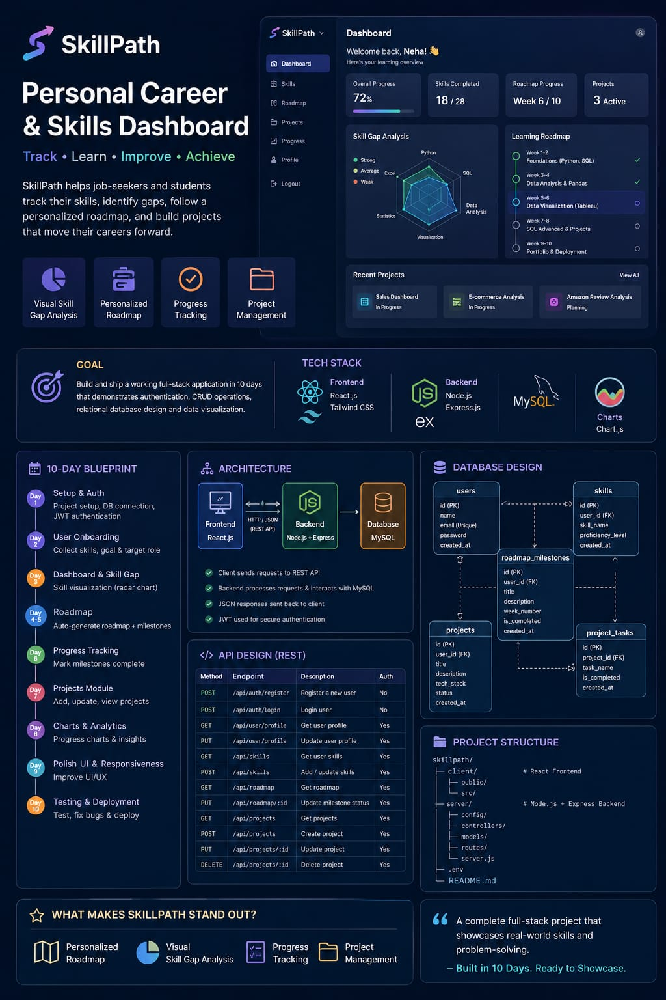

🚀 Day 53/60 – #60DayClaudeAIChallenge

Today was all about turning ideas into a structured, production-ready blueprint before writing a single line of code.

I designed the complete foundation for SkillPath— a Personal Career & Skills Dashboard that helps learners identify skill gaps, track progress, and build a clear roadmap toward their career goals.

📌 What I worked on today:

✅ Product Requirements Document (PRD)
✅ High-Level System Architecture
✅ Database Schema & ER Design
✅ REST API Endpoint Planning
✅ Project Folder Structure
✅ 10-Day Development Blueprint

🛠 Tech Stack

• React + Vite + Tailwind CSS
• Node.js + Express.js
• PostgreSQL + Prisma ORM
• JWT Authentication

Screenshot 

Image

💡 Key Learning

I realized that building software isn't just about coding—it's about designing scalable systems first. A well-defined architecture, clean database design, and organized API planning make development faster, cleaner, and far easier to maintain.

This challenge continues to teach me that investing time in planning saves much more time during implementation.

Looking forward to starting the actual development and bringing SkillPath to life! 🚀
