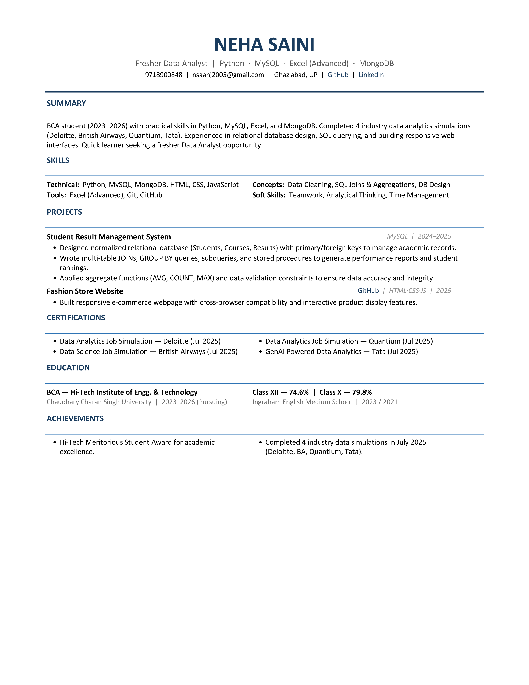
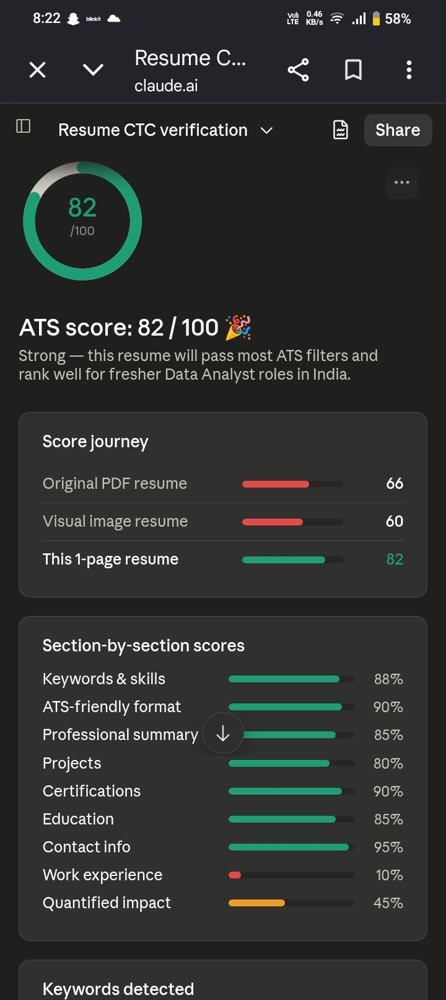
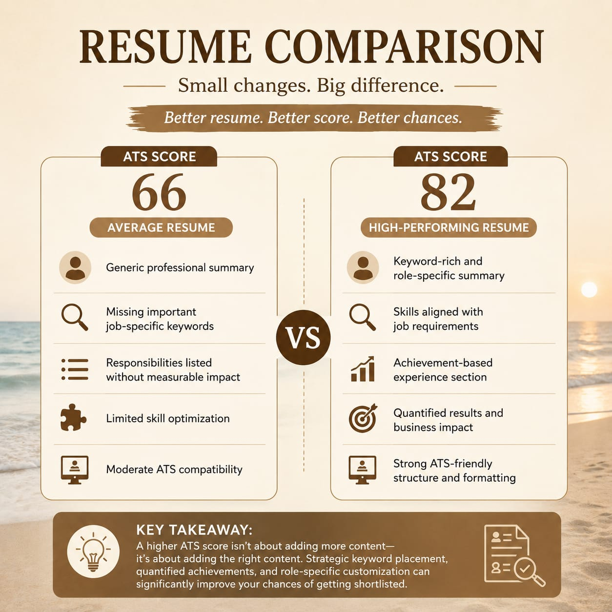

🚀 Day 6 of #60DaysClaudeAIChallenge

Today, I explored the impact of ATS (Applicant Tracking System) optimization by comparing two resumes with different ATS scores:

📄 Resume 1: ATS Score – 66 (Average)
📄 Resume 2: ATS Score – 82 (High)

🔍 Key Observations:
✅ ATS-friendly formatting improves resume readability.
✅ Job-specific keywords play a major role in increasing ATS scores.
✅ Clear section headings help ATS systems parse information accurately.
✅ Quantified achievements are more effective than generic responsibilities.
✅ Proper skills alignment with the target role boosts resume matching.
✅ Simple, clean layouts perform better than heavily designed resumes.

💡 What I Learned:
A resume isn't just for recruiters—it's also for ATS software.

Small improvements in keywords, structure, and content can significantly improve ATS performance.

Higher ATS scores increase the chances of getting shortlisted for interviews.

Original Resume

Optimized Resume

Screenshot 

Key Learning 

📈 This comparison showed how strategic resume optimization can make a noticeable difference in job applications.

